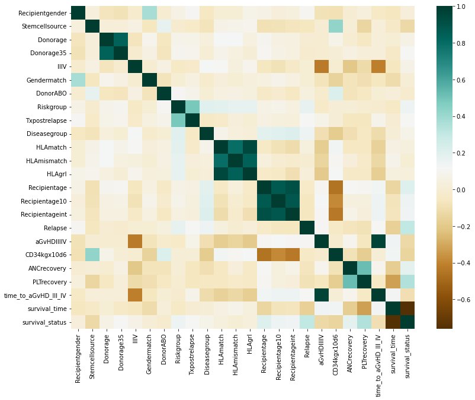
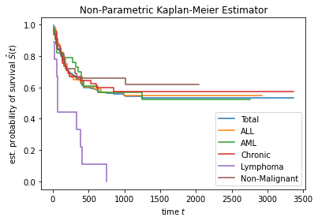

# Predicting Survival in Pediatric Bone Marrow Transplant Recipients
## Ryan Wang
### An analysis of pediatric bone marrow transplants, from a classification and survival perspective.

Project writeup can be found in `proj/report.pdf`. 

The project writeup R markdown can be found in `proj/report.Rmd`.

Project code can be found in `proj/bone_marrow.ipynb`.

Cleaned data can be found in `proj/bone-marrow.csv`.

# Introduction
## Why do we need bone marrow transplants? What are some complications that may occur?
Bone marrow transplants are an effective source of hematopoeitic stem cells, whose transplants constitutes important cell and gene therapies, treating a variety of disease, primarily hematological [1]. One of the main challenges with these therapeutics is the occurrence of Graft vs. Host disease (GVHD), in which the recipient immune system rejects the transplant due to the recipient immune complex recognizing the graft as a foreign entity (or vice versa) [1, 2]. This complication can lead to worse survival rates in transplant recipients, specifically in the non-disease relapse case [2]. This is primarily prevented through donor matching via MHC/HLA genotypes (immune recognition complexes) which hopefully reduces the chances of a recipient detecting the donor as *foreign* [2]. In addition to GVHD, another major complication is relapse after transplant [3]. Relapse can result in high mortality post-transplant, especially in the case of highly-malignant disease [3]. Children provide a unique target for these transplants as they do not have fully developed immune systems and so they both require less cells via the transplant and have lower rates of GVHD [1, 4]. As such, it is important to not only verify these claims, but to effectively model the chance of success for a given transplant in order to make better medical decisions in the future.

## An initial exploration of pediatric bone marrow transplants
A dataset of children who underwent bone marrow transplants will be used to build prediction models for survival outcome and time prediction [5]. There were 39 attributes accounting for donor age, ABO blood group, cytomegaloviral presence, recipient age, gender, body mass, ABO and RH groups, disease type, disease group, donor-recipient matches on gender, ABO, cytomegalaovirus, HLA, antigens, alleles, risk groups, stem cell sources, CD34 transmembrane expression, neutrophil recovery status/time, platelet recovery status/time, acute GVHD presence and time, extensive chronic GVHD development, disease relapse, survival time, and survival status. Initially, we performed a correlation analysis of numerical attributes to explore relationships between the attributes of the dataset (**Fig. 1**). 

{width=65%}

Interestingly, we find that mortality is positively associated with disease relapse and longer platelet recovery time. This agrees with the previous literature review as previously noted, and the longer platelet recovery time may cause increased risk of death due to worsening bleeding (where platelets function is blood clotting). We also explored missingness, and found that we have 5-10% missingness in many attributes, so we attempt to perform a multiple imputation, combining the resulting predictive performance with a complete-case analysis. We also show that disease type seems to be associated with survival through an initial Kaplan-Meier estimate stratified by disease type (Acute Lymphocytic Leukemia - ALL, Acute Myeloid Leukemia - AML, chronic, non-malignant, and lymphoma diseases), where lymphoma seems be associated with lower survival time and non-malignant disease is associated with a higher survival time (**Fig. 2**).

{width=50%}

## How do we make more informed medical decisions?
We aim to use machine learning models in order to predict survival outcome and model survival time, in order to provide a way of making better and more informed medical decisions before actually applying a treatment. We will do this by comparing parametric and non-parametric models, that is, the parametric Regularized Logistic Regression (RLR) versus the non-parametric Gradient-Boosted Classification Trees (GBCT) for modeling death outcome, and the semi-parametric Regularized Cox Proportional Hazards (RCPH) Regression versus the non-parametric Random Survival Forests for modeling survival time.

Data processing was performed in *R* (*tidyverse*) and *Python* (*pandas, numpy*), and all exploratory analysis, imputation, and modeling was performed in *Python* (*sklearn, xgboost, sksurv*).

# Results
## Feature selection
We first wanted to investigate what features should be used in order to achieve best predictive performance. Previously in the correlation analysis, we found some multicollinearity between recipient ages and HLA features, potentially because features are split into subsets. So in an attempt to get decorrelated features, we performed a principal components analysis and analyzed the variance explained by each principal component (**Fig. 3**).

{width=50%}

We find that the final ~5-10 principal components do not have as much information, however in general, we do not see a step drop in information provided, along with a relatively small dataset for prediction. Hence, we justify the use of the entire set of features as covariates for the classification and survival analysis task.

## Multiple imputation results in better predictions than a complete-case approach

As previously noted, we performed two modifications on the pediatric dataset, multiple imputation and a complete case analysis (removing missing observations). To analyze the predictive performance, specifically for classification of patient death, we modeled two logistic regressions under a 5-fold cross validation to choose the optimal L2 regularizer penalty. We evaluated the model using F-1, AUC, and accuracy to effectively determine the discriminative capability of this initial model (**Table 1**, **Fig. 4**). 

*Table 1. Comparison of missing data methods on penalized logistic regression performance.*
| | F1 | AUC | ACC |
| --- | --- | --- | --- |
| MICE | 0.3846 | 0.5536 | 0.5789 | 
| Complete Cases | 0.3000 | 0.4870 | 0.5172 |

{width=50%}

The MICE imputed data resulted in better predictions in all three metrics, however with logistic regression we still have relatively poor performance for this task. This model boasts an especially poor 0.3846 F-1 score suggesting a very poor discriminative capability, in fact, the confusion matrix was only 5-7% better than a 50% true positive and true negative rate. Hence, we would definitely not employ this model for production.

## Gradient-Boosted Classification Trees outperform Penalized Logistic Regression for classification

Due to the poor performance of the logistic regression, even with L2 penalty hyperparameter tuning, we attempt to use a most flexible non-parametric model, the gradient-boosted classification tree (GBCT). We performed a grid search cross validation using 5 folds to pick the best of a set of hyperparameters, resulting in an estimator that outperforms logistic regression by a wide margin in all three previously specified metrics (**Table 2**, **Fig. 5**). 

*Table 2. Comparison of parametric and non-parametric approaches.*
| | F1 | AUC | ACC |
| --- | --- | --- | --- |
| MICE LogReg | 0.3846 | 0.5536 | 0.5789 | 
| Complete Cases LogReg | 0.3000 | 0.4870 | 0.5172 |
| GBCT | 0.6875 | 0.7301 | 0.7368 |

{width=50%}

Similarly, this model approach improves on the true positive and true negative rates by around 20%. Together, this shows how powerful these more flexible modeling techniques can be, which is especially important in the context of medical diagnosis and prediction.

### Relapse, chronic GVHD, and platelet recovery important for determining survival outcome

Using the previously specified GBCT, we performed a feature importance analysis in order to learn more about what was contributing to this predictive power. Here, we measured importance by *XGBoost*'s **Gain** metric, that is, the accuracy gained by splitting on a feature (**Fig. 6**). 

{width=50%}

Interesting, like we initially saw in our exploratory correlation plot, we get the most accuracy gain from the *Relapse* feature, indicating whether or not an individual gets a hematological disease again. This makes sense, as a disease reoccuring might suggest something faulty with the immune system, or that the disease may have overcome some resistence and so it may be more lethal. This highlights the previously stated importance of relapse in transplant complications [3]. The second most important predictor was the development of Extensive Chronic Graft vs. Host Disease. This again, agrees with previous literature, and especially highlighting the **chronic** GVHD because unlike the acute version, chronic GVHD has been shown to be the most significant complication (apart from relaps) in child recipients [4]. Furthermore, the third most important predictor, *time until platelet recovery* also resulted in a large gain of accuracy. This makes sense as platelets are an important part of the immune system and so a longer period of time until full recovery would increase the change of death. Together, these data show the interpretability and performance of GBCTs, highlighting the support they provide for claims shown in literature and our correlation analysis.

## Random Survival Forests outperform Penalized Cox Proportional Hazards for survival analysis

Finally, we investigated the actual survival times rather than purely the death outcome. We initially showed non-parametric Kaplan-Meier estimates showing a relatively unbalanced set of survival proportions, where lymphoma prescence was the only population that resulted in 0% survival (**Fig. 2**). In order to use these data for prediction, we first use a Penalized Cox Proportional Hazards model in order to take a semi-parametric appraoch, rather than going straight into a flexible model choice. We find that the survival curves are relatively parallel (except the lymphoma population), and so we take this approach. We perform a 5-fold cross validation in order to choose an Elastic Net linear scalar parameter to weight L1 and L2 penalization terms. Following this, we used a Random Survival Forest (RSF) in order to flexibly model time to death without hyperparmeter tuning. Even without tuning, the RSF outperforms the Cox model using *c*-index as a metric, essentially discriminating risk incorporating survival time over between pairs of individuals (**Table 3**, **Fig. 7**). 

*Table 3. Comparison of semi-parametric and non-parametric survival analysis methods.*
| | c-index |
| --- | --- |
| Cox | 0.6895 |
| RSF | 0.7152 |

{width=50%}

We notice that RSF predictions tend to have lower survival on average, but spread the probabilities out, while the Cox model has a relatively imbalanced distribution. This suggests, even in terms of survival analysis, for the prediction task, non-parametric tree-based models like RSFs are able to effectively model the survival time over regression. 

One limitation we see however, is that RSFs can be a bit more difficult to work with as they lack immediately interpretable features unlike coefficients from a regression model. However, purely for predictive performance, RSFs are favoured in these data. Furthermore, we did not perform hyperparameter tuning for RSFs (while we did on the Cox model), and doing so may further improve on these results. In addition, the previously noted imbalanced Cox distribution could be potentially due to the imbalanced dataset stratified on malignancy/disease, and so, having a more balanced dataset or performing weighting/subsampling might change these results.

# Conclusion

Overall, we highlight the effectiveness of non-parametric modeling approaches in predicting both death outcome and predicting survival times. While more difficult than in regression, we provide support for empirical evidence on predictors of death post-bone marrow transplant in children including *chronic GVHD*, *platelet recovery time*, and *disease relapse* [2, 3, 4]. We show that non-parametric models outperform standard regression models even with penalization in terms of accuracy and discriminative accuracy. By being able to better predict the outcome of a patient given the potential bone marrow transplant approach, we will be able to make a more informed decision about whether the given approach is likely to work or fail. Furthermore, if a transplant was *absolutely necessary*, we could model the survival curves of the patients in order to predict in advance, where in time a patient might need more care (if they had a low predicted survival probability at the timepoint). In doing so, we may be able to make better medical procedure decisions resulting in an overall better outcome for patients on average.

# References
1. Simpson, E. & Dazzi, F. Bone Marrow Transplantation 1957-2019. Frontiers in Immunology 10, (2019). 
2. Sung, A. D. & Chao, N. J. Concise review: Acute graft-versus-host disease: Immunobiology, prevention, and treatment. Stem Cells Translational Medicine 2, 25–32 (2012). 
3. Barrett, A. J. & Battiwalla, M. Relapse after Allogeneic Stem Cell transplantation. Expert Review of Hematology 3, 429–441 (2010). 
4. Baird, K., Cooke, K. & Schultz, K. R. Chronic graft-versus-host disease (GVHD) in children. Pediatric Clinics of North America 57, 297–322 (2010). 
5. Sikora M., Wrobel L., & Gudys A. GuideR: A guided separate-and-conquer rule learning in classification, regression, and survival settings. Knowledge-Based Systems (2019). Accessed from: https://archive.ics.uci.edu/ml/datasets/Bone+marrow+transplant%3A+children 
